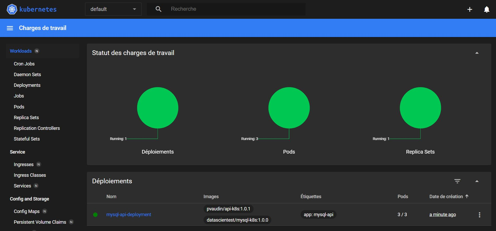
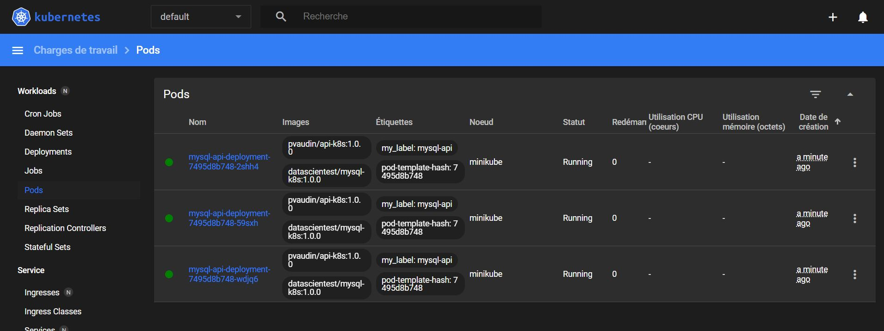
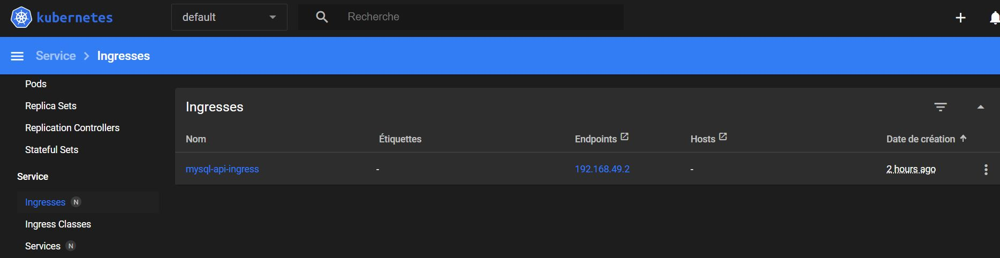
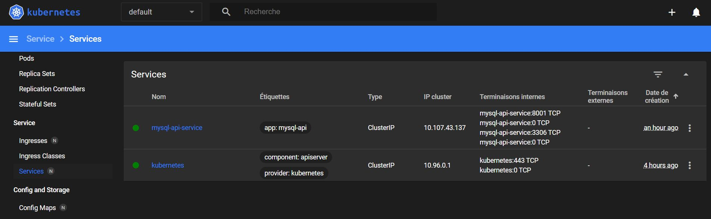
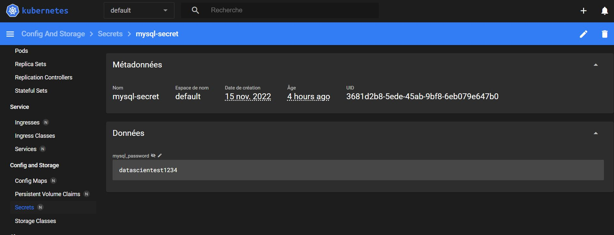
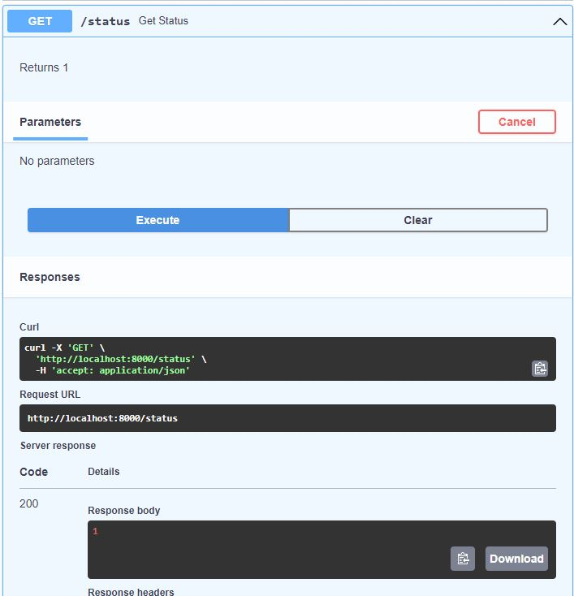
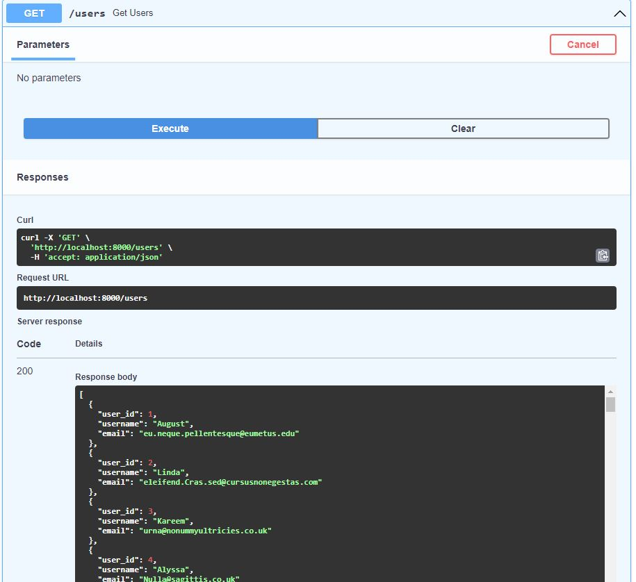
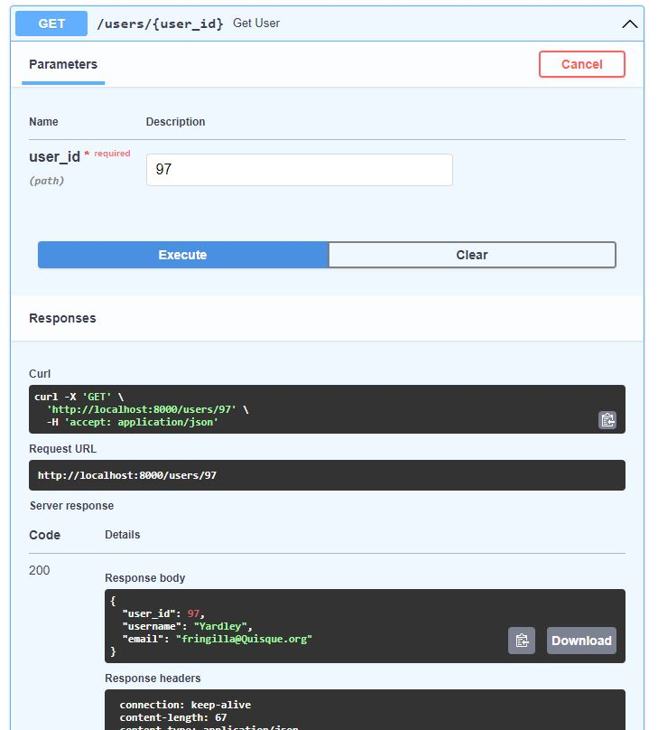

# K8s MySQL API

We want to deploy an API on a Kubernetes cluster of 3 Pods.

Each Pods consists of 2 containers:
- First is a MySQL Database generated with the following docker image : `datascientest/mysql-k8s:1.0.0`
- Second is a FastAPI API generated from a [`Dockerfile`](Dockerfile) and uploaded in Docker Hub

`Service` and `Ingress` must be configured to allow API access.


# Password Encoding

1. Encode password in Base64 Encoding with
    ```
    echo -n 'datascientest1234' | base64

    ZGF0YXNjaWVudGVzdDEyMzQ=
    ```
2. Put encoded password in the `secret` YAML
3. In the `deployment` YAML, set the environment variable MYSQL_PASSWORD with the key in `secret` YAML

# Docker Image Build

After completing the `main.py` file we must build the Docker Image with:
```bash
docker build . -t pvaudin/api-k8s:1.0.1
```
To put it in the **Docker Hub**, we must :
- create a repository in Docker Hub (An account must be created beforehand)
- login in the terminal
    ```bash
    docker login
    ```
- After the Image is built, push it to the Hub
    ```
    docker image push pvaudin/api-k8s:1.0.1
    ```

# Files

```bash
.
├── Dockerfile
├── README.md
├── files
│   ├── main.py
│   └── requirements.txt
├── my-deployment-eval.yml
├── my-ingress-eval.yml
├── my-secret-eval.yml
└── my-service-eval.yml
```

- [`Dockerfile`](Dockerfile) : Allow building the API container after main.py is completed
- [`main.py`](files/main.py) : API source code completed with **URL** and **password** variables
- [`requirements.txt`](files/requirements.txt) : Necessary packages to build the Docker Image
- [`my-deployment-eval.yml`](my-deployment-eval.yml) : *Deployment* configuration
- [`my-service-eval.yml`](my-service-eval.yml) : *Service* configuration for inside cluster communication
- [`my-ingress-eval.yml`](my-ingress-eval.yml) : *Ingress* configuration for outside cluster communication
- [`my-secret-eval.yml`](my-secret-eval.yml) : *Secret* configuration with password encoding


# Setup
On linux (VM or not) terminal enter following commands. Packages `minikube` and `kubectl` must be installed

first terminal: (start local Kubernetes cluster)
```
minikube start
minikube dashboard --url=true
```

Second terminal (allow local access to dashboard)
```
kubectl proxy --address='0.0.0.0' --disable-filter=true
```

Third terminal (build kubernetes cluster)
```
kubectl create -f my-deployment-eval.yml
kubectl create -f my-secret-eval.yml 
kubectl create -f my-service-eval.yml
kubectl create -f my-ingress-eval.yml
```

Tests on the cluster can then be made

# Dashboard

**Dashboard Overview**


**Pods**


**Ingress**


**Service**


**Secret**



# Manual Results on VM

**GET /status**

```bash
curl -X GET http://192.168.49.2/status
```

```json
1
```

**GET /users**

```bash
curl -X GET http://192.168.49.2/users
```

```json
[
  {
    "user_id": 1,
    "username": "August",
    "email": "eu.neque.pellentesque@eumetus.edu"
  },
  {
    "user_id": 2,
    "username": "Linda",
    "email": "eleifend.Cras.sed@cursusnonegestas.com"
  },
  {
    "user_id": 3,
    "username": "Kareem",
    "email": "urna@nonummyultricies.co.uk"
  },
  {
    "user_id": 4,
    "username": "Alyssa",
    "email": "Nulla@sagittis.co.uk"
  },
  {
    "user_id": 5,
    "username": "Demetria",
    "email": "nibh@maurisa.ca"
  },
  {
    "user_id": 6,
    "username": "Ahmed",
    "email": "enim.nisl@ac.net"
  },
  {
    "user_id": 7,
    "username": "Chantale",
    "email": "dictum.eleifend.nunc@Praesentinterdumligula.edu"
  },
  {
    "user_id": 8,
    "username": "Marny",
    "email": "ut.ipsum.ac@vehicula.net"
  },
  ...
  ```

**GET /users/id**

```bash
curl -X GET http://192.168.49.2/users/97
```

```json
{"user_id":97,"username":"Yardley","email":"fringilla@Quisque.org"}
```

# Results with OpenAPI

**GET /status**



**GET /users**



**GET /users/id**

